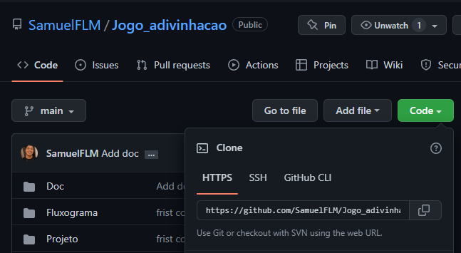
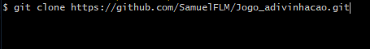
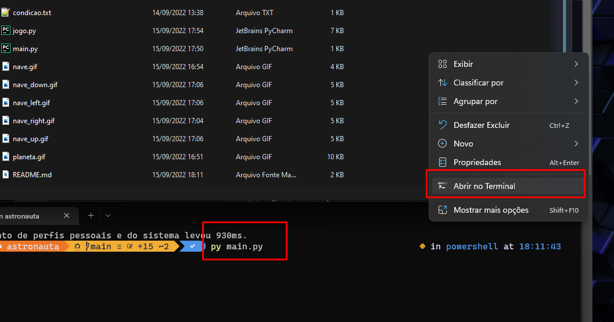

# Sistema Login Back-End

<!---Esses são exemplos. Veja https://shields.io para outras pessoas ou para personalizar este conjunto de escudos. Você pode querer incluir dependências, status do projeto e informações de licença aqui--->


> Um Jogo que ainda está em desevolvimento ajuste futuros:

- [X] Disponibilizar V1 inicial.
- [ ] Correção de bug imagem
- [ ] Desenvolvimento sistema colisão
- [ ] Desenvolvimento Pontuação e Rodadas
- [ ] Desenvolvimento multiplayer aonde quem chega primeiro vence

## 💻 Pré-requisitos

Antes de começar, verifique se você atendeu aos seguintes requisitos:

* Python 3.X na maquina instalado
* Foi utilizado para Desenvolvimento: Documentação Turtle Python

## 🚀 Instalando Projeto Python

Para Jogar o Game, siga estas etapas:


Windows:
```
Acesse o repositorio do projeto
Clique em Code
Copie a url
```


```
acesse o git bash na área de trabalho
Git Clone url_do_projeto
Abrir pasta do projeto
abrir terminal 
digitar: 
py main.py
Pronto!!! :)
```




